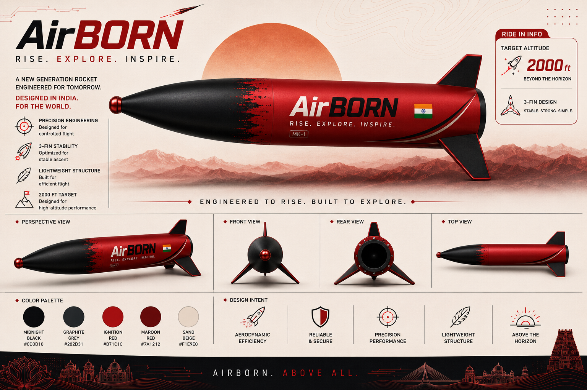

# 🚀 **AirBORN** 🚀
### RISE. EXPLORE. INSPIRE.

  
  
  

*A NEW GENERATION ROCKET ENGINEERED FOR TOMORROW.*

---

## 🔴 1. Executive Summary

* **Project Name:** AirBORN
* **Classification:** High-Power / Mid-Power Model Rocket (Class G Motor Tier)
* **Design Objectives:** Achieve a target apogee of ~2,000 ft (610 m), maintain an aerodynamic stability margin between 1.1–1.5 cal, and execute a safe, low-shock parachute recovery below 7 m/s landing velocity.
* **Design & Simulation Software:** OpenRocket

---

## ⚫ 2. General Airframe & Geometric Specifications

| Parameter | Dimension / Specification |
| :--- | :--- |
| **Total Rocket Length** | 62.0 cm |
| **Maximum Body Diameter** | 7.5 cm (3.0 in) |
| **Dry Mass (No Motor)** | ~276 g – 336 g (with nose ballast) |
| **Liftoff Mass (With Motor)** | ~423 g – 464 g |
| **Center of Gravity (CG)** | 34.6 cm – 39.5 cm from nose tip |
| **Center of Pressure (CP)** | 42.8 cm from nose tip |
| **Caliber Stability** | 1.1 cal – 1.44 cal (13.4% – 17.5%) |

---

## 🔴 3. Component Breakdown & Materials

### 🔻 Nose Cone
* **Geometry:** Tangent Ogive Profile
* **Material:** Custom Fiberglass / Composite / 3D Print
* **Internal Ballast:** 40 g to 60 g of lead shot / steel BBs encapsulated in slow-cure 2-part epoxy resin at the extreme tip to anchor aerodynamic stability.

### ⬛ Main Body Tube
* **Dimensions:** Outer Diameter 7.5 cm, Length ~39.5 cm
* **Material:** Rigid composite / structural tube (shuttlecock storage tube geometry)
* **Finish:** Smooth regular paint (60 µm) for low skin-friction drag.

### 🔻 Fin Assembly
* **Configuration:** 3-fin symmetric planar set (120° radial spacing)
* **Fin Shape:** Trapezoidal
* **Root Chord:** 12.0 cm
* **Tip Chord:** 5.0 cm
* **Height (Span):** 7.0 cm
* **Sweep Length:** 5.0 cm (Sweep Angle: 19.7°)
* **Thickness:** 0.3 cm (3 mm)
* **Cross-Section:** Sanded Airfoil / Rounded leading edges
* **Material:** 3 mm Aircraft/Birch Plywood (density = 0.63 g/cm³) attached with structural epoxy root fillets.

### ⬛ Propulsion Subassembly (Motor Mount)
* **Inner Tube Diameter:** Outer Diameter 3.8 cm (38 mm mount), Inner Diameter 3.5 cm (or adapted to 2.9 cm for 29 mm casings)
* **Inner Tube Length:** 15.0 cm
* **Centering Rings:** Dual 3 mm Birch Plywood rings (OD 7.3 cm, ID 3.8 cm) positioned at +2 cm and +13 cm from the aft end.

### 🔻 Recovery System
* **Parachute Canopy:** 45 cm diameter hemispherical canopy made of Ripstop Nylon (67 g/m², Cd = 0.800)
* **Shroud Lines:** 6 braided nylon / tubular lines (45 cm line length)
* **Shock Cord:** Tubular Kevlar / high-strength elastic harness anchored to the forward centering ring bulkhead.

---

## ⚫ 4. Propulsion & Simulated Flight Performance

> **Reference Motor:** Custom Sugar Motor (KNSB / KNSU G-Class, 38 mm Casing)

* **Propellant Mass:** 125 g (65:35 KNO₃ : Sugar/Sorbitol)
* **Total Loaded Motor Mass:** ~240 g (Burnout mass: ~115 g)
* **Total Impulse (I_tot):** ~140 N·s
* **Peak Altitude (Apogee):** ~625 m (2,050 ft)
* **Max Velocity:** ~175 m/s (Mach 0.51 / 630 km/h)
* **Peak Acceleration:** ~135 m/s² (~13.8 g)
* **Average Thrust:** ~78 N (Burn Time: ~1.8 s)
* **Coast Time:** ~4.9 s (Total time to apogee: ~6.7 s)
* **Recovery Deployment:** Ejection charge / altimeter deployment triggered at apogee (~6.5 s - 7.0 s delay)
* **Descent Velocity at Touchdown:** ~6.8 m/s

---

## 🔴 5. Key Construction & Fabrication Guidelines

1. **Fin Grain Alignment:** Cut fin blanks so the wood grain runs parallel to the diagonal leading edge to resist aerodynamic flutter.
2. **Epoxy Filleting:** Form smooth double-sided epoxy fillets along every fin-to-tube joint.
3. **Ballast Immobilization:** Fully pot the nose cone ballast in epoxy to prevent center-of-gravity shifts during high-g liftoff.
4. **Recovery Protection:** Wrap the parachute canopy in flame-resistant recovery wadding or a nomex chute protector before sliding it into the upper payload bay.

 

  <h3>AIRBORN. ABOVE ALL.</h3>

